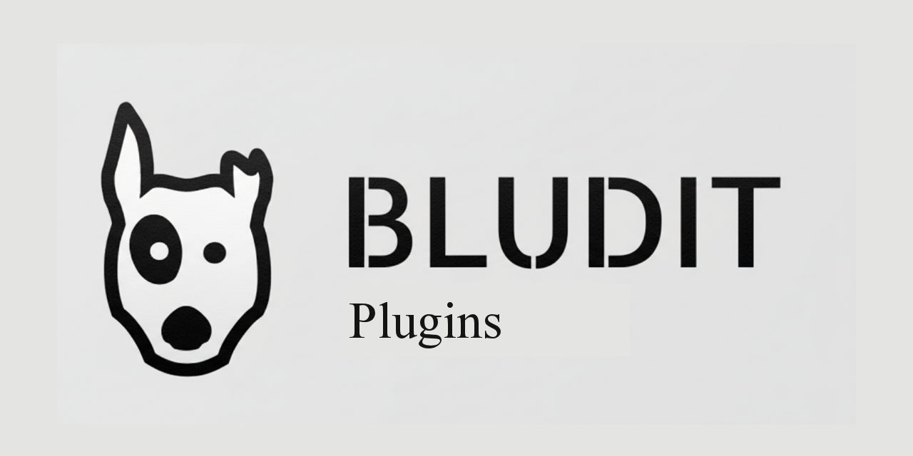

# Bludit PLugins

[Home](README.md) - Plugins - Issues

---

This is the mainpage for the bludit plugins i made.  
All the plugins are [open source](http://localhost/bluditplugins/admin/edit-content/.../bluditplugins/what-is-open-source) and [privacy focussed](https://www.wisepedia.org/privacy-focused/).
